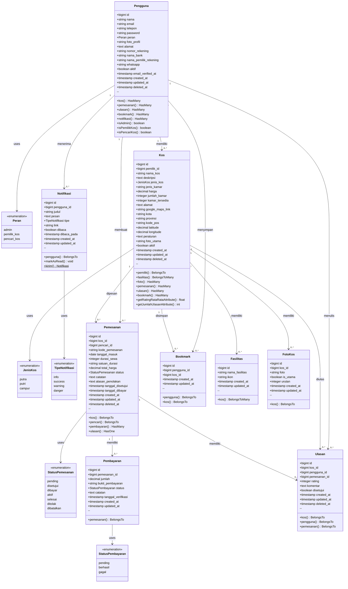

# Class Diagram - Sistem E-Kos

## Diagram UML

## Deskripsi Entitas

### 1. Pengguna
Entitas utama yang merepresentasikan pengguna sistem dengan 3 peran:
- **Admin**: Mengelola seluruh sistem
- **Pemilik Kos**: Mengelola kos dan pemesanan
- **Pencari Kos**: Mencari dan memesan kos

**Atribut Penting:**
- `nomor_rekening`, `nama_bank`, `nama_pemilik_rekening`: Untuk pembayaran
- `whatsapp`: Untuk komunikasi
- `aktif`: Status aktif/nonaktif pengguna

### 2. Kos
Entitas yang merepresentasikan properti kos yang ditawarkan.

**Atribut Penting:**
- `jenis_kos`: Putra, Putri, atau Campur
- `kamar_tersedia`: Jumlah kamar yang masih tersedia
- `latitude`, `longitude`: Koordinat lokasi
- `google_maps_link`: Link ke Google Maps

### 3. Pemesanan
Entitas yang merepresentasikan transaksi pemesanan kos.

**Status Flow:**
1. `pending` → Menunggu persetujuan pemilik
2. `disetujui` → Disetujui, menunggu pembayaran
3. `dibayar` → Sudah bayar, menunggu verifikasi
4. `aktif` → Pembayaran terverifikasi, pemesanan aktif
5. `selesai` → Masa sewa selesai
6. `ditolak` → Ditolak oleh pemilik
7. `dibatalkan` → Dibatalkan oleh pencari

### 4. Pembayaran
Entitas yang merepresentasikan bukti pembayaran dari pencari kos.

**Status:**
- `pending`: Menunggu verifikasi
- `berhasil`: Terverifikasi
- `gagal`: Ditolak

### 5. Ulasan
Entitas yang merepresentasikan review dari pencari kos setelah masa sewa selesai.

**Atribut:**
- `rating`: 1-5 bintang
- `disetujui`: Moderasi oleh admin

### 6. Bookmark
Entitas untuk menyimpan kos favorit pencari.

### 7. Fasilitas
Entitas master fasilitas yang tersedia (WiFi, AC, Parkir, dll).

**Relasi:** Many-to-Many dengan Kos melalui tabel pivot `fasilitas_kos`

### 8. FotoKos
Entitas untuk menyimpan multiple foto kos.

**Atribut:**
- `is_utama`: Menandai foto utama
- `urutan`: Urutan tampilan foto

### 9. Notifikasi
Entitas untuk sistem notifikasi real-time.

**Tipe:**
- `info`: Informasi umum
- `success`: Notifikasi sukses
- `warning`: Peringatan
- `danger`: Notifikasi penting

## Relasi Antar Entitas

### One-to-Many
- Pengguna → Kos (1 pemilik memiliki banyak kos)
- Pengguna → Pemesanan (1 pencari membuat banyak pemesanan)
- Pengguna → Ulasan (1 pengguna menulis banyak ulasan)
- Pengguna → Bookmark (1 pengguna menyimpan banyak bookmark)
- Pengguna → Notifikasi (1 pengguna menerima banyak notifikasi)
- Kos → Pemesanan (1 kos dipesan berkali-kali)
- Kos → Ulasan (1 kos diulas berkali-kali)
- Kos → FotoKos (1 kos memiliki banyak foto)
- Pemesanan → Pembayaran (1 pemesanan bisa memiliki banyak pembayaran)

### One-to-One
- Pemesanan → Ulasan (1 pemesanan hanya bisa diulas 1 kali)

### Many-to-Many
- Kos ↔ Fasilitas (Banyak kos memiliki banyak fasilitas)

## Fitur Utama Sistem

1. **Manajemen Pengguna**: Multi-role (Admin, Pemilik, Pencari)
2. **Manajemen Kos**: CRUD kos dengan foto dan fasilitas
3. **Sistem Pemesanan**: Flow pemesanan dengan status tracking
4. **Sistem Pembayaran**: Upload dan verifikasi bukti transfer
5. **Sistem Ulasan**: Rating dan review dengan moderasi
6. **Bookmark**: Simpan kos favorit
7. **Notifikasi**: Real-time notification system
8. **Geolokasi**: Integrasi Google Maps

## Teknologi

- **Framework**: Laravel 11
- **Database**: MySQL
- **Authentication**: Laravel Sanctum/Breeze
- **Storage**: Laravel Storage (Public Disk)
- **Soft Deletes**: Untuk data recovery
