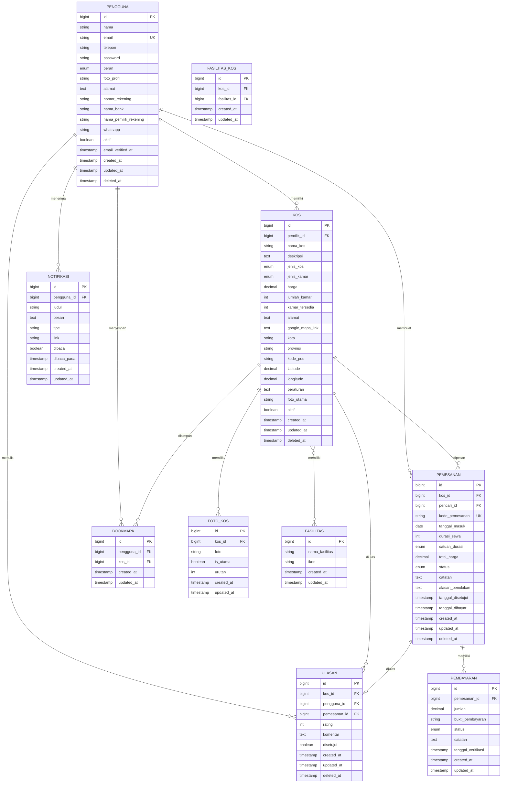

# Skema Database - Sistem E-Kos

## Daftar Isi
- [Overview](#overview)
- [Entity Relationship Diagram](#entity-relationship-diagram)
- [Tabel Database](#tabel-database)
- [Relasi Antar Tabel](#relasi-antar-tabel)
- [Indeks dan Constraint](#indeks-dan-constraint)
- [Enum Values](#enum-values)

---

## Overview

Sistem E-Kos menggunakan **MySQL** sebagai database dengan total **10 tabel utama**:
1. `pengguna` - Data pengguna sistem
2. `kos` - Data properti kos
3. `pemesanan` - Data transaksi pemesanan
4. `pembayaran` - Data pembayaran
5. `ulasan` - Data review dan rating
6. `bookmark` - Data kos favorit
7. `fasilitas` - Master data fasilitas
8. `fasilitas_kos` - Pivot table kos dan fasilitas
9. `foto_kos` - Data foto kos
10. `notifikasi` - Data notifikasi pengguna

---

## Entity Relationship Diagram



---

## Tabel Database

### 1. Tabel `pengguna`

Menyimpan data pengguna sistem dengan 3 role berbeda.

| Kolom | Tipe | Nullable | Default | Keterangan |
|-------|------|----------|---------|------------|
| `id` | BIGINT | NO | AUTO_INCREMENT | Primary Key |
| `nama` | VARCHAR(255) | NO | - | Nama lengkap pengguna |
| `email` | VARCHAR(255) | NO | - | Email (unique) |
| `telepon` | VARCHAR(20) | YES | NULL | Nomor telepon |
| `password` | VARCHAR(255) | NO | - | Password (hashed) |
| `peran` | ENUM | NO | 'pencari_kos' | Role: admin, pemilik_kos, pencari_kos |
| `foto_profil` | VARCHAR(255) | YES | NULL | Path foto profil |
| `alamat` | TEXT | YES | NULL | Alamat lengkap |
| `nomor_rekening` | VARCHAR(255) | YES | NULL | Nomor rekening bank |
| `nama_bank` | VARCHAR(255) | YES | NULL | Nama bank |
| `nama_pemilik_rekening` | VARCHAR(255) | YES | NULL | Nama pemilik rekening |
| `whatsapp` | VARCHAR(20) | YES | NULL | Nomor WhatsApp |
| `aktif` | BOOLEAN | NO | TRUE | Status aktif/nonaktif |
| `email_verified_at` | TIMESTAMP | YES | NULL | Waktu verifikasi email |
| `remember_token` | VARCHAR(100) | YES | NULL | Token remember me |
| `created_at` | TIMESTAMP | YES | NULL | Waktu dibuat |
| `updated_at` | TIMESTAMP | YES | NULL | Waktu diupdate |
| `deleted_at` | TIMESTAMP | YES | NULL | Waktu dihapus (soft delete) |

**Indexes:**
- PRIMARY KEY: `id`
- UNIQUE KEY: `email`

**Soft Delete:** ✅ Ya

---

### 2. Tabel `kos`

Menyimpan data properti kos yang ditawarkan.

| Kolom | Tipe | Nullable | Default | Keterangan |
|-------|------|----------|---------|------------|
| `id` | BIGINT | NO | AUTO_INCREMENT | Primary Key |
| `pemilik_id` | BIGINT | NO | - | Foreign Key ke pengguna |
| `nama_kos` | VARCHAR(255) | NO | - | Nama kos |
| `deskripsi` | TEXT | YES | NULL | Deskripsi kos |
| `jenis_kos` | ENUM | NO | - | putra, putri, campur |
| `jenis_kamar` | ENUM | NO | - | kamar_mandi_dalam, kamar_mandi_luar |
| `harga` | DECIMAL(10,2) | NO | - | Harga sewa per bulan |
| `jumlah_kamar` | INT | NO | 1 | Total jumlah kamar |
| `kamar_tersedia` | INT | NO | 1 | Jumlah kamar tersedia |
| `alamat` | TEXT | NO | - | Alamat lengkap |
| `google_maps_link` | TEXT | YES | NULL | Link Google Maps |
| `kota` | VARCHAR(100) | NO | - | Nama kota |
| `provinsi` | VARCHAR(100) | NO | - | Nama provinsi |
| `kode_pos` | VARCHAR(10) | YES | NULL | Kode pos |
| `latitude` | DECIMAL(10,7) | YES | NULL | Koordinat latitude |
| `longitude` | DECIMAL(10,7) | YES | NULL | Koordinat longitude |
| `peraturan` | TEXT | YES | NULL | Peraturan kos |
| `foto_utama` | VARCHAR(255) | YES | NULL | Path foto utama |
| `aktif` | BOOLEAN | NO | TRUE | Status aktif/nonaktif |
| `created_at` | TIMESTAMP | YES | NULL | Waktu dibuat |
| `updated_at` | TIMESTAMP | YES | NULL | Waktu diupdate |
| `deleted_at` | TIMESTAMP | YES | NULL | Waktu dihapus (soft delete) |

**Indexes:**
- PRIMARY KEY: `id`
- FOREIGN KEY: `pemilik_id` REFERENCES `pengguna(id)` ON DELETE CASCADE

**Soft Delete:** ✅ Ya

---

### 3. Tabel `pemesanan`

Menyimpan data transaksi pemesanan kos.

| Kolom | Tipe | Nullable | Default | Keterangan |
|-------|------|----------|---------|------------|
| `id` | BIGINT | NO | AUTO_INCREMENT | Primary Key |
| `kos_id` | BIGINT | NO | - | Foreign Key ke kos |
| `pencari_id` | BIGINT | NO | - | Foreign Key ke pengguna |
| `kode_pemesanan` | VARCHAR(255) | NO | - | Kode unik pemesanan |
| `tanggal_masuk` | DATE | NO | - | Tanggal mulai sewa |
| `durasi_sewa` | INT | NO | - | Durasi sewa |
| `satuan_durasi` | ENUM | NO | 'bulan' | hari, bulan, tahun |
| `total_harga` | DECIMAL(15,2) | NO | - | Total harga sewa |
| `status` | ENUM | NO | 'pending' | Status pemesanan |
| `catatan` | TEXT | YES | NULL | Catatan dari pencari |
| `alasan_penolakan` | TEXT | YES | NULL | Alasan jika ditolak |
| `tanggal_disetujui` | TIMESTAMP | YES | NULL | Waktu disetujui |
| `tanggal_dibayar` | TIMESTAMP | YES | NULL | Waktu dibayar |
| `created_at` | TIMESTAMP | YES | NULL | Waktu dibuat |
| `updated_at` | TIMESTAMP | YES | NULL | Waktu diupdate |
| `deleted_at` | TIMESTAMP | YES | NULL | Waktu dihapus (soft delete) |

**Status Values:**
- `pending` - Menunggu persetujuan pemilik
- `disetujui` - Disetujui, menunggu pembayaran
- `ditolak` - Ditolak oleh pemilik
- `dibayar` - Sudah dibayar, menunggu verifikasi
- `aktif` - Pembayaran terverifikasi, pemesanan aktif
- `selesai` - Masa sewa selesai
- `dibatalkan` - Dibatalkan oleh pencari

**Indexes:**
- PRIMARY KEY: `id`
- UNIQUE KEY: `kode_pemesanan`
- FOREIGN KEY: `kos_id` REFERENCES `kos(id)` ON DELETE CASCADE
- FOREIGN KEY: `pencari_id` REFERENCES `pengguna(id)` ON DELETE CASCADE

**Soft Delete:** ✅ Ya


---

### 4. Tabel `pembayaran`

Menyimpan data bukti pembayaran dari pencari kos.

| Kolom | Tipe | Nullable | Default | Keterangan |
|-------|------|----------|---------|------------|
| `id` | BIGINT | NO | AUTO_INCREMENT | Primary Key |
| `pemesanan_id` | BIGINT | NO | - | Foreign Key ke pemesanan |
| `jumlah` | DECIMAL(10,2) | NO | - | Jumlah yang dibayar |
| `bukti_pembayaran` | VARCHAR(255) | YES | NULL | Path file bukti transfer |
| `status` | ENUM | NO | 'pending' | pending, berhasil, gagal |
| `catatan` | TEXT | YES | NULL | Catatan verifikasi |
| `tanggal_verifikasi` | TIMESTAMP | YES | NULL | Waktu diverifikasi |
| `created_at` | TIMESTAMP | YES | NULL | Waktu dibuat |
| `updated_at` | TIMESTAMP | YES | NULL | Waktu diupdate |

**Indexes:**
- PRIMARY KEY: `id`
- FOREIGN KEY: `pemesanan_id` REFERENCES `pemesanan(id)` ON DELETE CASCADE

**Soft Delete:** ❌ Tidak

---

### 5. Tabel `ulasan`

Menyimpan data review dan rating dari pencari kos.

| Kolom | Tipe | Nullable | Default | Keterangan |
|-------|------|----------|---------|------------|
| `id` | BIGINT | NO | AUTO_INCREMENT | Primary Key |
| `kos_id` | BIGINT | NO | - | Foreign Key ke kos |
| `pengguna_id` | BIGINT | NO | - | Foreign Key ke pengguna |
| `pemesanan_id` | BIGINT | YES | NULL | Foreign Key ke pemesanan |
| `rating` | INT | NO | - | Rating 1-5 bintang |
| `komentar` | TEXT | YES | NULL | Komentar ulasan |
| `disetujui` | BOOLEAN | NO | TRUE | Status moderasi |
| `created_at` | TIMESTAMP | YES | NULL | Waktu dibuat |
| `updated_at` | TIMESTAMP | YES | NULL | Waktu diupdate |
| `deleted_at` | TIMESTAMP | YES | NULL | Waktu dihapus (soft delete) |

**Indexes:**
- PRIMARY KEY: `id`
- FOREIGN KEY: `kos_id` REFERENCES `kos(id)` ON DELETE CASCADE
- FOREIGN KEY: `pengguna_id` REFERENCES `pengguna(id)` ON DELETE CASCADE
- FOREIGN KEY: `pemesanan_id` REFERENCES `pemesanan(id)` ON DELETE CASCADE

**Soft Delete:** ✅ Ya

---

### 6. Tabel `bookmark`

Menyimpan data kos favorit yang disimpan oleh pencari kos.

| Kolom | Tipe | Nullable | Default | Keterangan |
|-------|------|----------|---------|------------|
| `id` | BIGINT | NO | AUTO_INCREMENT | Primary Key |
| `pengguna_id` | BIGINT | NO | - | Foreign Key ke pengguna |
| `kos_id` | BIGINT | NO | - | Foreign Key ke kos |
| `created_at` | TIMESTAMP | YES | NULL | Waktu dibuat |
| `updated_at` | TIMESTAMP | YES | NULL | Waktu diupdate |

**Indexes:**
- PRIMARY KEY: `id`
- UNIQUE KEY: `pengguna_id, kos_id` (composite unique)
- FOREIGN KEY: `pengguna_id` REFERENCES `pengguna(id)` ON DELETE CASCADE
- FOREIGN KEY: `kos_id` REFERENCES `kos(id)` ON DELETE CASCADE

**Soft Delete:** ❌ Tidak

---

### 7. Tabel `fasilitas`

Master data fasilitas yang tersedia (WiFi, AC, Parkir, dll).


| Kolom | Tipe | Nullable | Default | Keterangan |
|-------|------|----------|---------|------------|
| `id` | BIGINT | NO | AUTO_INCREMENT | Primary Key |
| `nama_fasilitas` | VARCHAR(255) | NO | - | Nama fasilitas |
| `ikon` | VARCHAR(255) | YES | NULL | Icon class (Font Awesome) |
| `created_at` | TIMESTAMP | YES | NULL | Waktu dibuat |
| `updated_at` | TIMESTAMP | YES | NULL | Waktu diupdate |

**Indexes:**
- PRIMARY KEY: `id`

**Soft Delete:** ❌ Tidak

---

### 8. Tabel `fasilitas_kos` (Pivot Table)

Tabel penghubung many-to-many antara kos dan fasilitas.

| Kolom | Tipe | Nullable | Default | Keterangan |
|-------|------|----------|---------|------------|
| `id` | BIGINT | NO | AUTO_INCREMENT | Primary Key |
| `kos_id` | BIGINT | NO | - | Foreign Key ke kos |
| `fasilitas_id` | BIGINT | NO | - | Foreign Key ke fasilitas |
| `created_at` | TIMESTAMP | YES | NULL | Waktu dibuat |
| `updated_at` | TIMESTAMP | YES | NULL | Waktu diupdate |

**Indexes:**
- PRIMARY KEY: `id`
- FOREIGN KEY: `kos_id` REFERENCES `kos(id)` ON DELETE CASCADE
- FOREIGN KEY: `fasilitas_id` REFERENCES `fasilitas(id)` ON DELETE CASCADE

**Soft Delete:** ❌ Tidak

---

### 9. Tabel `foto_kos`

Menyimpan multiple foto untuk setiap kos.


| Kolom | Tipe | Nullable | Default | Keterangan |
|-------|------|----------|---------|------------|
| `id` | BIGINT | NO | AUTO_INCREMENT | Primary Key |
| `kos_id` | BIGINT | NO | - | Foreign Key ke kos |
| `foto` | VARCHAR(255) | NO | - | Path file foto |
| `is_utama` | BOOLEAN | NO | FALSE | Penanda foto utama |
| `urutan` | INT | NO | 0 | Urutan tampilan foto |
| `created_at` | TIMESTAMP | YES | NULL | Waktu dibuat |
| `updated_at` | TIMESTAMP | YES | NULL | Waktu diupdate |

**Indexes:**
- PRIMARY KEY: `id`
- FOREIGN KEY: `kos_id` REFERENCES `kos(id)` ON DELETE CASCADE

**Soft Delete:** ❌ Tidak

---

### 10. Tabel `notifikasi`

Menyimpan notifikasi untuk pengguna.

| Kolom | Tipe | Nullable | Default | Keterangan |
|-------|------|----------|---------|------------|
| `id` | BIGINT | NO | AUTO_INCREMENT | Primary Key |
| `pengguna_id` | BIGINT | NO | - | Foreign Key ke pengguna |
| `judul` | VARCHAR(255) | NO | - | Judul notifikasi |
| `pesan` | TEXT | NO | - | Isi pesan notifikasi |
| `tipe` | VARCHAR(255) | NO | 'info' | info, success, warning, danger |
| `link` | VARCHAR(255) | YES | NULL | Link tujuan notifikasi |
| `dibaca` | BOOLEAN | NO | FALSE | Status sudah dibaca |
| `dibaca_pada` | TIMESTAMP | YES | NULL | Waktu dibaca |
| `created_at` | TIMESTAMP | YES | NULL | Waktu dibuat |
| `updated_at` | TIMESTAMP | YES | NULL | Waktu diupdate |

**Indexes:**
- PRIMARY KEY: `id`
- FOREIGN KEY: `pengguna_id` REFERENCES `pengguna(id)` ON DELETE CASCADE

**Soft Delete:** ❌ Tidak


---

## Relasi Antar Tabel

### 1. One-to-Many Relationships

#### Pengguna → Kos
- **Relasi:** Satu pemilik kos dapat memiliki banyak kos
- **Foreign Key:** `kos.pemilik_id` → `pengguna.id`
- **On Delete:** CASCADE
- **Eloquent:** `Pengguna::kos()` dan `Kos::pemilik()`

#### Pengguna → Pemesanan
- **Relasi:** Satu pencari kos dapat membuat banyak pemesanan
- **Foreign Key:** `pemesanan.pencari_id` → `pengguna.id`
- **On Delete:** CASCADE
- **Eloquent:** `Pengguna::pemesanan()` dan `Pemesanan::pencari()`

#### Pengguna → Ulasan
- **Relasi:** Satu pengguna dapat menulis banyak ulasan
- **Foreign Key:** `ulasan.pengguna_id` → `pengguna.id`
- **On Delete:** CASCADE
- **Eloquent:** `Pengguna::ulasan()` dan `Ulasan::pengguna()`

#### Pengguna → Bookmark
- **Relasi:** Satu pengguna dapat menyimpan banyak bookmark
- **Foreign Key:** `bookmark.pengguna_id` → `pengguna.id`
- **On Delete:** CASCADE
- **Eloquent:** `Pengguna::bookmark()` dan `Bookmark::pengguna()`

#### Pengguna → Notifikasi
- **Relasi:** Satu pengguna dapat menerima banyak notifikasi
- **Foreign Key:** `notifikasi.pengguna_id` → `pengguna.id`
- **On Delete:** CASCADE
- **Eloquent:** `Pengguna::notifikasi()` dan `Notifikasi::pengguna()`

#### Kos → Pemesanan
- **Relasi:** Satu kos dapat dipesan berkali-kali
- **Foreign Key:** `pemesanan.kos_id` → `kos.id`
- **On Delete:** CASCADE
- **Eloquent:** `Kos::pemesanan()` dan `Pemesanan::kos()`


#### Kos → Ulasan
- **Relasi:** Satu kos dapat diulas berkali-kali
- **Foreign Key:** `ulasan.kos_id` → `kos.id`
- **On Delete:** CASCADE
- **Eloquent:** `Kos::ulasan()` dan `Ulasan::kos()`

#### Kos → Bookmark
- **Relasi:** Satu kos dapat disimpan oleh banyak pengguna
- **Foreign Key:** `bookmark.kos_id` → `kos.id`
- **On Delete:** CASCADE
- **Eloquent:** `Kos::bookmark()` dan `Bookmark::kos()`

#### Kos → FotoKos
- **Relasi:** Satu kos dapat memiliki banyak foto
- **Foreign Key:** `foto_kos.kos_id` → `kos.id`
- **On Delete:** CASCADE
- **Eloquent:** `Kos::foto()` dan `FotoKos::kos()`

#### Pemesanan → Pembayaran
- **Relasi:** Satu pemesanan dapat memiliki banyak pembayaran (jika ditolak bisa upload ulang)
- **Foreign Key:** `pembayaran.pemesanan_id` → `pemesanan.id`
- **On Delete:** CASCADE
- **Eloquent:** `Pemesanan::pembayaran()` dan `Pembayaran::pemesanan()`

### 2. One-to-One Relationships

#### Pemesanan → Ulasan
- **Relasi:** Satu pemesanan hanya dapat diulas satu kali
- **Foreign Key:** `ulasan.pemesanan_id` → `pemesanan.id`
- **On Delete:** CASCADE
- **Eloquent:** `Pemesanan::ulasan()` dan `Ulasan::pemesanan()`

### 3. Many-to-Many Relationships

#### Kos ↔ Fasilitas
- **Relasi:** Banyak kos dapat memiliki banyak fasilitas
- **Pivot Table:** `fasilitas_kos`
- **Foreign Keys:** 
  - `fasilitas_kos.kos_id` → `kos.id`
  - `fasilitas_kos.fasilitas_id` → `fasilitas.id`
- **On Delete:** CASCADE (both)
- **Eloquent:** `Kos::fasilitas()` dan `Fasilitas::kos()`


---

## Indeks dan Constraint

### Primary Keys
Semua tabel menggunakan `id` sebagai primary key dengan tipe BIGINT AUTO_INCREMENT.

### Unique Constraints
1. **pengguna.email** - Email harus unik
2. **pemesanan.kode_pemesanan** - Kode pemesanan harus unik
3. **bookmark(pengguna_id, kos_id)** - Composite unique untuk mencegah duplikasi bookmark

### Foreign Key Constraints
Semua foreign key menggunakan **ON DELETE CASCADE**, artinya:
- Jika pengguna dihapus → semua kos, pemesanan, ulasan, bookmark, dan notifikasi miliknya ikut terhapus
- Jika kos dihapus → semua pemesanan, ulasan, bookmark, foto, dan relasi fasilitas ikut terhapus
- Jika pemesanan dihapus → semua pembayaran dan ulasan terkait ikut terhapus

### Soft Deletes
Tabel yang menggunakan soft delete (kolom `deleted_at`):
- ✅ `pengguna`
- ✅ `kos`
- ✅ `pemesanan`
- ✅ `ulasan`

Tabel tanpa soft delete:
- ❌ `pembayaran`
- ❌ `bookmark`
- ❌ `fasilitas`
- ❌ `fasilitas_kos`
- ❌ `foto_kos`
- ❌ `notifikasi`

---

## Enum Values

### 1. pengguna.peran
```sql
ENUM('admin', 'pemilik_kos', 'pencari_kos')
DEFAULT 'pencari_kos'
```
- **admin** - Administrator sistem
- **pemilik_kos** - Pemilik properti kos
- **pencari_kos** - Pencari/penyewa kos


### 2. kos.jenis_kos
```sql
ENUM('putra', 'putri', 'campur')
```
- **putra** - Khusus laki-laki
- **putri** - Khusus perempuan
- **campur** - Laki-laki dan perempuan

### 3. kos.jenis_kamar
```sql
ENUM('kamar_mandi_dalam', 'kamar_mandi_luar')
```
- **kamar_mandi_dalam** - Kamar dengan kamar mandi di dalam
- **kamar_mandi_luar** - Kamar dengan kamar mandi di luar (bersama)

### 4. pemesanan.satuan_durasi
```sql
ENUM('hari', 'bulan', 'tahun')
DEFAULT 'bulan'
```
- **hari** - Sewa harian
- **bulan** - Sewa bulanan
- **tahun** - Sewa tahunan

### 5. pemesanan.status
```sql
ENUM('pending', 'disetujui', 'ditolak', 'dibayar', 'aktif', 'selesai', 'dibatalkan')
DEFAULT 'pending'
```

**Flow Status Normal:**
1. **pending** → Pemesanan baru, menunggu persetujuan pemilik
2. **disetujui** → Disetujui pemilik, menunggu pembayaran dari pencari
3. **dibayar** → Pencari sudah upload bukti pembayaran, menunggu verifikasi
4. **aktif** → Pembayaran terverifikasi, pemesanan aktif
5. **selesai** → Masa sewa selesai

**Flow Status Alternatif:**
- **ditolak** → Pemesanan ditolak oleh pemilik (dari pending)
- **dibatalkan** → Pemesanan dibatalkan oleh pencari (dari pending/disetujui)

### 6. pembayaran.status
```sql
ENUM('pending', 'berhasil', 'gagal')
DEFAULT 'pending'
```
- **pending** - Menunggu verifikasi pemilik
- **berhasil** - Pembayaran terverifikasi dan diterima
- **gagal** - Pembayaran ditolak (bukti tidak valid)


### 7. notifikasi.tipe
```sql
VARCHAR(255)
DEFAULT 'info'
```
- **info** - Notifikasi informasi umum (biru)
- **success** - Notifikasi sukses (hijau)
- **warning** - Notifikasi peringatan (kuning)
- **danger** - Notifikasi penting/error (merah)

---

## Business Rules & Logic

### 1. Kode Pemesanan
- **Format:** `KOS-YYYYMMDD-XXXXXX`
- **Contoh:** `KOS-20251118-A3F9E2`
- **Generate:** Otomatis saat pemesanan dibuat (via Model Boot)

### 2. Ketersediaan Kamar
- `kamar_tersedia` berkurang saat pemesanan berstatus `aktif`
- `kamar_tersedia` bertambah saat pemesanan `selesai` atau `dibatalkan`
- Validasi: `kamar_tersedia` tidak boleh < 0

### 3. Rating Kos
- Rating dihitung dari rata-rata `ulasan.rating` yang `disetujui = true`
- Accessor: `Kos::getRatingRataRataAttribute()`
- Range: 0-5 (float)

### 4. Pembayaran Multiple
- Satu pemesanan bisa memiliki multiple pembayaran
- Scenario: Jika pembayaran pertama ditolak (`status = gagal`), pencari bisa upload ulang
- Hanya pembayaran dengan `status = berhasil` yang mengubah status pemesanan

### 5. Ulasan
- Hanya bisa dibuat setelah pemesanan `selesai`
- Satu pemesanan hanya bisa diulas 1 kali
- Admin bisa moderasi dengan field `disetujui`

### 6. Bookmark
- Composite unique constraint mencegah duplikasi
- Pencari bisa bookmark/unbookmark kos kapan saja

### 7. Notifikasi
- Dikirim otomatis saat event tertentu:
  - Pemesanan baru → ke pemilik
  - Pemesanan disetujui/ditolak → ke pencari
  - Bukti pembayaran diupload → ke pemilik
  - Pembayaran diverifikasi → ke pencari


---

## Data Types Summary

### Numeric Types
- **BIGINT** - Primary keys dan foreign keys
- **INT** - Jumlah kamar, durasi sewa, rating, urutan
- **DECIMAL(10,2)** - Harga, jumlah pembayaran
- **DECIMAL(15,2)** - Total harga pemesanan (untuk nilai besar)
- **DECIMAL(10,7)** - Koordinat latitude/longitude
- **BOOLEAN** - Flag aktif, dibaca, disetujui, is_utama

### String Types
- **VARCHAR(255)** - Nama, email, path file, judul
- **VARCHAR(100)** - Kota, provinsi
- **VARCHAR(20)** - Telepon, whatsapp, kode pos
- **VARCHAR(10)** - Kode pos
- **TEXT** - Deskripsi, alamat, catatan, pesan, komentar, peraturan

### Date/Time Types
- **DATE** - Tanggal masuk
- **TIMESTAMP** - Created at, updated at, deleted at, verifikasi, dibaca

### Enum Types
- **ENUM** - Peran, jenis kos, jenis kamar, satuan durasi, status

---

## Storage & File Management

### File Upload Locations
Semua file disimpan di `storage/app/public/` dengan struktur:

```
storage/app/public/
├── profil/          # Foto profil pengguna
├── kos/             # Foto utama kos
├── foto-kos/        # Foto tambahan kos
├── pembayaran/      # Bukti pembayaran
└── fasilitas/       # Icon fasilitas (optional)
```

### File Naming Convention
- Menggunakan Laravel Storage dengan hash otomatis
- Format: `{hash}.{extension}`
- Contoh: `a3f9e2b1c4d5e6f7.jpg`

### File Size Limits
- Foto profil: Max 2MB
- Foto kos: Max 2MB per foto
- Bukti pembayaran: Max 2MB

### Allowed File Types
- Image: JPG, JPEG, PNG


---

## Security Considerations

### 1. Password Hashing
- Menggunakan bcrypt (Laravel default)
- Cost factor: 12
- Tidak pernah disimpan dalam plain text

### 2. Soft Deletes
- Data penting (pengguna, kos, pemesanan, ulasan) menggunakan soft delete
- Memungkinkan recovery data jika diperlukan
- Data tidak benar-benar terhapus dari database

### 3. Cascade Deletes
- Semua foreign key menggunakan ON DELETE CASCADE
- Memastikan integritas referensial
- Mencegah orphaned records

### 4. Unique Constraints
- Email pengguna harus unik
- Kode pemesanan harus unik
- Bookmark tidak boleh duplikat (composite unique)

### 5. Data Validation
- Validasi di level aplikasi (Laravel Request)
- Validasi di level database (constraints, enum)
- Sanitasi input untuk mencegah SQL injection

---

## Performance Optimization

### Recommended Indexes

Selain index yang sudah ada, pertimbangkan menambahkan:

```sql
-- Index untuk pencarian kos
CREATE INDEX idx_kos_kota ON kos(kota);
CREATE INDEX idx_kos_jenis ON kos(jenis_kos);
CREATE INDEX idx_kos_harga ON kos(harga);
CREATE INDEX idx_kos_aktif ON kos(aktif);

-- Index untuk filter pemesanan
CREATE INDEX idx_pemesanan_status ON pemesanan(status);
CREATE INDEX idx_pemesanan_tanggal ON pemesanan(tanggal_masuk);

-- Index untuk notifikasi
CREATE INDEX idx_notifikasi_dibaca ON notifikasi(pengguna_id, dibaca);

-- Index untuk ulasan
CREATE INDEX idx_ulasan_rating ON ulasan(kos_id, rating);
```

### Query Optimization Tips
1. Gunakan eager loading untuk relasi (with())
2. Paginate hasil query yang banyak
3. Cache query yang sering diakses (rating, jumlah ulasan)
4. Gunakan select() untuk membatasi kolom yang diambil


---

## Migration History

### Initial Migrations (2025-11-16)
1. `2025_11_16_115040_buat_tabel_pengguna.php` - Tabel pengguna
2. `2025_11_16_115041_buat_tabel_kos.php` - Tabel kos
3. `2025_11_16_115042_buat_tabel_pemesanan.php` - Tabel pemesanan
4. `2025_11_16_115050_buat_tabel_fasilitas_kos.php` - Tabel fasilitas & pivot
5. `2025_11_16_115051_buat_tabel_foto_kos.php` - Tabel foto kos
6. `2025_11_16_115052_buat_tabel_pembayaran.php` - Tabel pembayaran
7. `2025_11_16_115053_buat_tabel_ulasan.php` - Tabel ulasan
8. `2025_11_16_115054_buat_tabel_bookmark.php` - Tabel bookmark

### Updates (2025-11-16)
9. `2025_11_16_162431_tambah_status_aktif_ke_pemesanan.php` - Tambah status 'aktif'
10. `2025_11_16_170050_tambah_google_maps_link_ke_kos.php` - Tambah Google Maps link
11. `2025_11_16_173400_create_notifikasi_table.php` - Tabel notifikasi

---

## Database Diagram (Text)

```
┌─────────────┐
│  PENGGUNA   │
├─────────────┤
│ id (PK)     │
│ nama        │
│ email (UK)  │
│ peran       │
│ ...         │
└──────┬──────┘
       │
       ├──────────────────────────────────┐
       │                                  │
       ▼                                  ▼
┌─────────────┐                    ┌─────────────┐
│     KOS     │                    │  PEMESANAN  │
├─────────────┤                    ├─────────────┤
│ id (PK)     │◄───────────────────│ id (PK)     │
│ pemilik_id  │                    │ kos_id (FK) │
│ nama_kos    │                    │ pencari_id  │
│ jenis_kos   │                    │ status      │
│ harga       │                    │ ...         │
│ ...         │                    └──────┬──────┘
└──────┬──────┘                           │
       │                                  ▼
       │                           ┌─────────────┐
       │                           │ PEMBAYARAN  │
       │                           ├─────────────┤
       │                           │ id (PK)     │
       │                           │ pemesanan_id│
       │                           │ jumlah      │
       │                           │ status      │
       │                           └─────────────┘
       │
       ├──────────────┬──────────────┬──────────────┐
       ▼              ▼              ▼              ▼
┌─────────────┐ ┌──────────┐  ┌──────────┐  ┌──────────┐
│   ULASAN    │ │ BOOKMARK │  │ FOTO_KOS │  │FASILITAS │
├─────────────┤ ├──────────┤  ├──────────┤  │   _KOS   │
│ id (PK)     │ │ id (PK)  │  │ id (PK)  │  ├──────────┤
│ kos_id (FK) │ │ kos_id   │  │ kos_id   │  │ kos_id   │
│ rating      │ │pengguna  │  │ foto     │  │fasilitas │
└─────────────┘ └──────────┘  └──────────┘  └──────────┘
```

---

## Backup & Maintenance

### Backup Strategy
1. **Daily Backup** - Full database backup setiap hari
2. **Weekly Backup** - Backup dengan retention 4 minggu
3. **Monthly Backup** - Backup dengan retention 12 bulan

### Maintenance Tasks
1. **Cleanup Soft Deleted Records** - Hapus permanent data yang sudah > 90 hari
2. **Optimize Tables** - Jalankan OPTIMIZE TABLE secara berkala
3. **Update Statistics** - Jalankan ANALYZE TABLE untuk query optimizer
4. **Archive Old Data** - Archive pemesanan yang sudah selesai > 1 tahun

---

## Version Information

- **Database Engine:** MySQL 8.0+
- **Character Set:** utf8mb4
- **Collation:** utf8mb4_unicode_ci
- **Laravel Version:** 11.x
- **Last Updated:** 2025-11-18

---

## Contact & Support

Untuk pertanyaan atau issue terkait database schema, silakan hubungi tim development.
